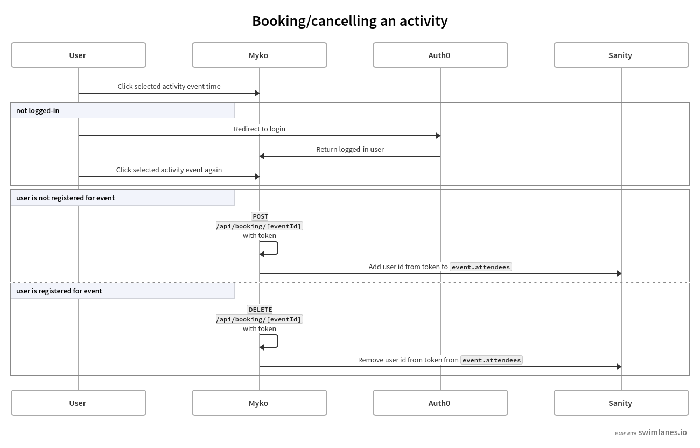
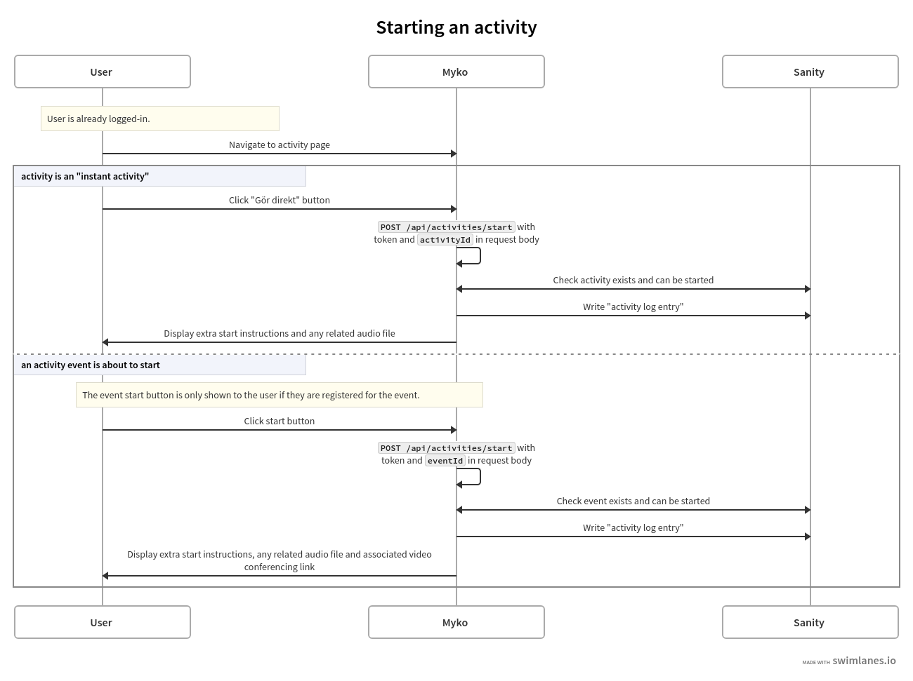
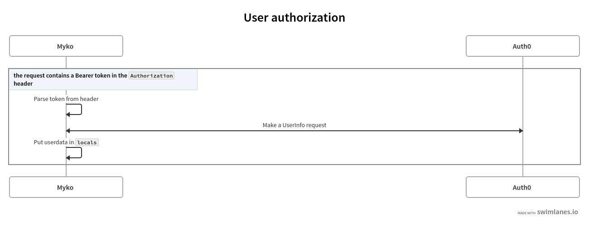

# Myko

## Developing

Once you've installed the dependencies with `npm install`,
start a development server:

```bash
npm run dev

# or start the server and open the app in a new browser tab
npm run dev -- --open
```

To make sure you can test all functionality of the app you need to generate ["Robot tokens" for Sanity](https://www.sanity.io/docs/http-auth#4c21d7b829fe).
One token with only read permission and one token with writer permission should be added to your local `.env` file,
as `SANITY_READ_TOKEN` and `SANITY_WRITE_TOKEN` respectively.

An `.editorconfig` exists in the directory and the code style is automatically enforced via `prettier` (`npm run format`).

## Deploying

The app is currently hosted on Netlify which automatically builds the app
with the config specified in [`netlify.toml`](./netlify.toml).

### Production preview

To create a production version of your app:

```bash
npm run build
```

You can preview the production build with `npm run preview`.

## Tech stack

The app uses [SvelteKit](https://kit.svelte.dev) as the web framework
and stores the data with [Sanity](https://www.sanity.io/).
User authentication and user data is handled with [Auth0](https://auth0.com/), and a ["hook"](https://kit.svelte.dev/docs/hooks) automatically tries to fetch authorization data for any token in the request (see below).

## Flow charts

### Booking an activity



_[Source](https://swimlanes.io/#jZCxTsMwEIbn+inuBUKYPVQqkAEJBErLhJBi7Gt6imMj+xLUt8dOChnokO0k//f9n4+JLUq4874j15ZaOY3WphGUA6WZRuKzEG8RQ7F9Pndewr0l3UFEi5rR/IUAR3QMTD0KQUcJzjNY37ZoCnJikxFQbGE38OlWQo2GQiIA+5zKieklR+aeGnkIbkHAkAgLZ42MalUCozOzUQYAxcksYEuRMaSlow9zXmwydIE3ry/7A5Tqi8rPy4Hep+Cj+Wjgm/iU7Dt0AuB3ca9cqpewM+ZSl/jB93Mwf7aZCDeKOXkhxkagjbjIrRJ7qJ6qQ7VO7b9cjb0f8ZrfNF4xTBf8AQ==)_

### Starting an activity/event



_[Source](https://swimlanes.io/#pVNBbtswEDyLr1joHMd3o8ilBYoe2gZwilxNiyt5IWLpkCsn+lg+kI91SSayD0nRoheBEGdnZmckIfG4ga3YKMQDWAbbCZ1IZmM4CMKvhHFTnkAJrI9o3Qw+DAO6FfG1yVerm+/zGDbww55osDolYeGBox3QGOo351eZiaElTmJZlvetaYrQ6gYq32dP3Qjt15fnCI4ijtLCfhIJbJqMOCN3tz+3d7C2R1q/shGmdcp77eCR5KCWRuTGsoPdm943twNiiPgwYRLYBzcbKITwSZm3lhWkLg6oLhbz+ERJ8gIOOt1ij1Bk0L3NXozeR9I02mVWcwNkibrqGVwj/kLp6G2ml2grJeSA4qTDgaug5Vnteo1Yz5OjAD15VC6DPmmRF/0BnlSpRL0Pk+RKCqlpll6vanZ3B3wFV9WacJ4M7GdIh/DIeVwUN5UPoc/nGWxEdTNoHBjVUB9iwRSua9O8W+alhEL+o8Ui836FH5ZY1/xTg80/VbhI/XWNVx90WOtNKXRUbk7kMEAXuNdsucs/pyceDbIzvwE=)_

### User authorization

A [SvelteKit hook](./src/hooks.ts) tries to parse any incoming Bearer token from the request using the following flow:



_[Source](https://swimlanes.io/#ZY4xCgIxEEVrc4p/AcE6iKCdxYKNfYbdWTbsmsHJpFhPbyIKitU07/15Fm1hj2tmBRWbROODLEpyLo4eNjGU74WzoZdkFFMG4cSkVTCZOSGmFxaO33rAxDSwuk23zoLtAe16XEgzv8VR5faL7SvXZnYeHc1cP7WwcxrlU/G3VwylMgMZtZKwSE9LDo7T4J4=)_

It puts the needed userdata in [`event.locals`](https://kit.svelte.dev/docs/types#sveltejs-kit-requestevent)
as the attribute `user`.
